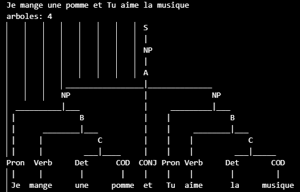
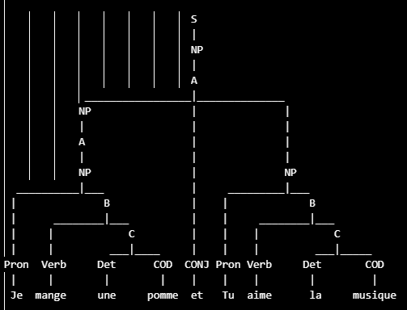
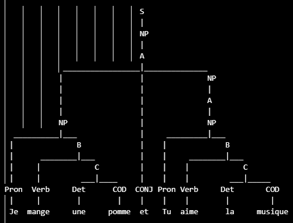
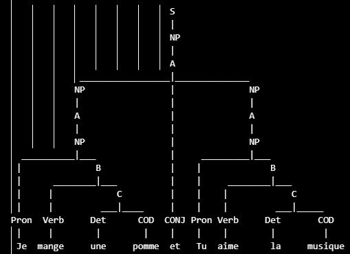
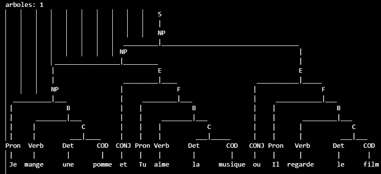

# FrenchGrammar-Evidence-2
Andrea Iliana Cantú Mayorga - A01753419

## Description
The french lannguage is spoken by over 330 million people around the world, making it the third most spoken language in Europe, following by German and English. 
<br>
It serves as the official language in several countries, including France, Canada, Belgium, Rwanda, and more. French is a Romance language, deriving primarily from Latin, and it has evolved through significant influences from over 120 other languages, including Gaulish, Frankish, and Old Norse. The language's history can be categorized into three main eras: Old French (840-1400), Middle French (1300-1500), and Modern French (1600-present) (EBSCO, 2026).

### Language Structure
French structures have a certain pattern and clear rules to follow. First we need to distinguish between simple and complex sentences. simple sentences has one conjugated verb, while complex sentences have two or more conjugated verbs. A sentence can be:
- positive or negative
- interrogative or declarative
- direct speech or indirect speech

#### Simple declarative sentences
We use a simple declarative sentence (une phrase affirmative simple) to state something – to recount an event, give information, share a thought and more – all in a positive form.
<br>

In French, word order is very important – you can only change it in certain cases. In a simple declarative sentence, the usual order is: subject – verb – object(s). This differs from a complex sentence, which contains two or more conjugated verbs. The direct object is directly affected by the action of the verb. We can see an example with the sentence *"Je mange une pomme"*:
* Je -> pronoun (subject).
* mange -> verb.
* une -> articulo indefinido.
* pomme -> object.
### Complex declarative sentences
They have the same structure as the simple decarative sentence, except it hass two verbs. In this case we are going to use the conjunctiones *et* (and) and *ou* (or). An example sentence can be *Je mange une pomme **et** tus manges une pomme*:
* Je -> pronoun (subject).
* mange -> verb.
* une -> articulo indefinido.
* pomme -> object.
* et -> conjunctions.
* Tu -> pronoun (subject).
* manges -> verb.
* une -> articulo indefinido.
* pizza -> object.

## Models
The model that we will be using is a grammar which can be validated for simple and declarative sentences. Here are some of the words that will be used in the grammar:
### Pronouns
* `Je:` I
* `Tu:` You
* `Elle:` She
* `Il:` He
* `Nous:` We
* `Vous:` You (formal/plural)
* `Elles:` They (feminine)
* `Ils:` They (masculine)

### Verbs (present tense conjugation)

* `mange:` eat
  * Je mange, Tu manges, Il/Elle mange, Nous mangeons, Vous mangez, Ils/Elles mangent

* `aime:` love/like
  * Je aime, Tu aimes, Il/Elle aime, Nous aimons, Vous aimez, Ils/Elles aiment

* `regarde:` watch
  * Je regarde, Tu regardes, Il/Elle regarde, Nous regardons, Vous regardez, Ils/Elles regardent

* `parle:` speak
  * Je parle, Tu parles, Il/Elle parle, Nous parlons, Vous parlez, Ils/Elles parlent

* `est:` is (être)
  * Je suis, Tu es, Il/Elle est, Nous sommes, Vous êtes, Ils/Elles sont

* `a:` has (avoir)
  * Je ai, Tu as, Il/Elle a, Nous avons, Vous avez, Ils/Elles ont

### Indefinite Articles
* `un:` a/an (masculine singular) — un film, un livre
* `une:` a/an (feminine singular) — une pomme, une pizza
* `des:` some (plural) — des films, des pommes

### Objects (COD - Direct Object Complement)

* `mange / aime:` (food)
  * `pomme:` apple
  * `pizza:` pizza
  * `orange:` orange
  * `gateau:` cake
  * `salade:` salad

* `regarde:` (things you watch)
  * `film:` movie
  * `serie:` series
  * `tableau:` painting
  * `match:` match/game

* `parle:` (languages/topics)
  * `francais:` French
  * `musique:` music
  * `livre:` book

* `ecoute:` (things you listen to)
  * `musique:` music
  * `chanson:` song
  * `radio:` radio

## Grammar
Lexical analysis or scanning, is the first phase of a compiler. In this phase, the compiler reads the source code character by character and groups them in subgroups called tokens, which are the passed to the next of compilation known as *syntax analysis*. <br>
In this evidence we are going to do a LL(1) with no backtracking or reccursive decent 
<br>
*Syntax analysis* is also called Parsing, which analize it to see make sure that the tokens are placed in a correct and meaningful order. If the structure is correct, then the parser creates a Parse Tree which shows the program's structure in clear hierarchical way and helps the compiler understand the code better.
Before making the parser LL(1), we need to check for *ambiguity* and *left recursion*
* Ambguity: it is when the samee input string can be parsed in more than one way, producing multiple parced trees.
* Left recursion: the tree can only grow towards the left not the right

### Initial Grammar
```pyton
S -> NP
NP -> Pron B | A
A -> NP CONJ NP | NP
B -> Verb C
C -> Det COD

Pron -> 'Je' | 'Tu' | 'Il' | 'Elle' | 'Nous' | 'Vous' | 'Ils' | 'Elles'
CONJ -> 'et' | 'ou'
Verb -> 'est' | 'avoir' | 'mange' | 'regarde' | 'parler' | 'aime' | 'a' | 'parle' | 'ecoute' | 'chante'
COD -> 'film' | 'pomme' | 'musique' | 'orange' | 'pizza' | 'peinture' | 'maison' | 'gateau' | 'salade' |'livre' | 'francais' | 'chanson' | 'radio'
Det -> 'le' | 'la' | 'une' | 'un'
```
In this grammar we have terminal and Non-Terminal variables, which will help us do the first and follow table, and transition table. The terminaal variables are the ones that are ging to give us to the final sentence, and the non-terminal are the ones that will give us the path to get there.
* Non-Terminal: S, NP, A, B, C
* Terminal: Pron, CONJ, Verb, COD, Det.<br>

This is my initial Grammar, given this grammar we can see that it has ambiguity, because if we try a sentence it creates more than one tree. It also hase left recursion because as we can see in NP, it diverges towards the left, making it have left recursion. In order ro have ambiguity, we have to use conjunctions or complex sentences. In this way the patterns repeat itself creating two or more trees. Using as example this sentence: `Je mange une pomme et Tu aime la musique`, which means `I eat an apple and you love music`. Given this complex sentence, we get four trees: 
| Tree | Image |
|------|-------|
| First tree |  |
| Second tree |  |
| Third tree |  |
| Fourth tree |  |
### Eliminate ambiguity
In order to eliminate ambiguity, you have to add intermidate states or subgroups, that indicates a presedence. After having a long time to process this, we get the following grammat without ambiguity: 
```pyton
S -> NP
    NP -> Pron B | NP E
    E -> CONJ F
    F -> Pron B
    B -> Verb C
    C -> Det COD

    Pron -> 'Je' | 'Tu' | 'Il' | 'Elle' | 'Nous' | 'Vous' | 'Ils' | 'Elles'
    CONJ -> 'et' | 'ou'
    Verb -> 'etre' | 'avoir' | 'mange' | 'regarde' | 'parler' | 'aime'
    COD -> 'film' | 'pomme' | 'musique' | 'orange' | 'pizza' | 'peinture' | 'maison'
    Det -> 'le' | 'la' | 'une' | 'un'
```
Know we are going to try it, using the python code to check if we have eliminated ambiguity completly.

As we can see in the example we only get one tree, meaning that we have eliminated it correctly.
## Grammar that recognizes the language

## Analysis

## References
https://www.ebsco.com/research-starters/language-and-linguistics/french-language
