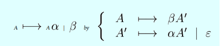
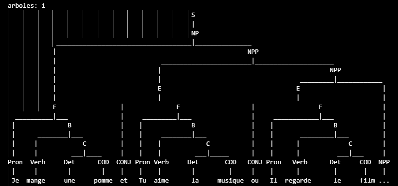
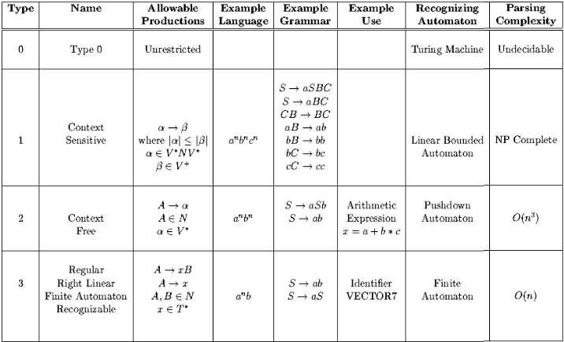
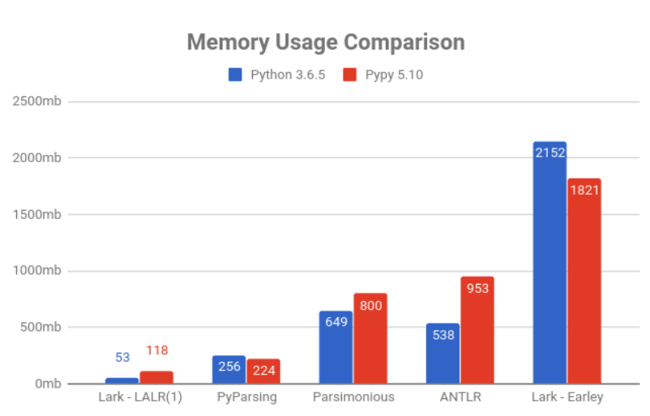
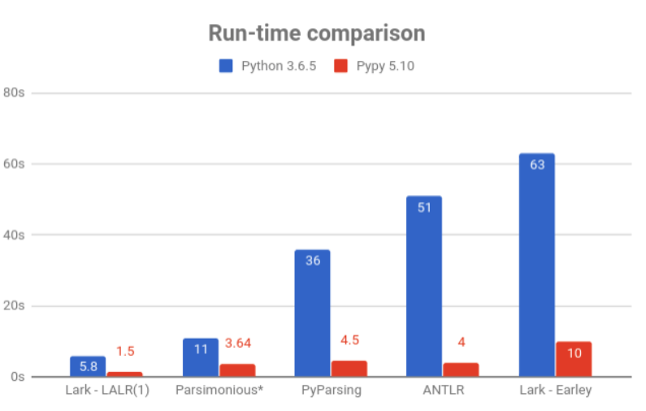

# FrenchGrammar-Evidence-2
Andrea Iliana Cantú Mayorga - A01753419

## Description
The french lannguage is spoken by over 330 million people around the world, making it the third most spoken language in Europe, following by German and English. 

It serves as the official language in several countries, including France, Canada, Belgium, Rwanda, and more. French is a Romance language, deriving primarily from Latin, and it has evolved through significant influences from over 120 other languages, including Gaulish, Frankish, and Old Norse. The language's history can be categorized into three main eras: Old French (840-1400), Middle French (1300-1500), and Modern French (1600-present) (EBSCO, 2026).

### Language Structure
French structures have a certain pattern and clear rules to follow. First we need to distinguish between simple and complex sentences. simple sentences has one conjugated verb, while complex sentences have two or more conjugated verbs. A sentence can be:
- positive or negative
- interrogative or declarative
- direct speech or indirect speech

#### Simple declarative sentences
We use a simple declarative sentence (une phrase affirmative simple) to state something – to recount an event, give information, share a thought and more – all in a positive form.


In French, word order is very important – you can only change it in certain cases. In a simple declarative sentence, the usual order is: subject – verb – object(s). This differs from a complex sentence, which contains two or more conjugated verbs. The direct object is directly affected by the action of the verb. We can see an example with the sentence *"Je mange une pomme"*:
* Je -> pronoun (subject).
* mange -> verb.
* une -> articulo indefinido.
* pomme -> object.
### Complex declarative sentences
They have the same structure as the simple decarative sentence, except it hass two verbs. In this case we are going to use the conjunctiones *et* (and) and *ou* (or). An example sentence can be *Je mange une pomme **et** tus manges une pomme*:
* Je -> pronoun (subject).
* mange -> verb.
* une -> articulo indefinido.
* pomme -> object.
* et -> conjunctions.
* Tu -> pronoun (subject).
* manges -> verb.
* une -> articulo indefinido.
* pizza -> object.

## Models
The model that we will be using is a grammar which can be validated for simple and declarative sentences. Here are some of the words that will be used in the grammar:
### Pronouns
* `Je:` I
* `Tu:` You
* `Elle:` She
* `Il:` He
* `Nous:` We
* `Vous:` You (formal/plural)
* `Elles:` They (feminine)
* `Ils:` They (masculine)

### Verbs (present tense conjugation)

* `mange:` eat
  * Je mange, Tu manges, Il/Elle mange, Nous mangeons, Vous mangez, Ils/Elles mangent

* `aime:` love/like
  * Je aime, Tu aimes, Il/Elle aime, Nous aimons, Vous aimez, Ils/Elles aiment

* `regarde:` watch
  * Je regarde, Tu regardes, Il/Elle regarde, Nous regardons, Vous regardez, Ils/Elles regardent

* `parle:` speak
  * Je parle, Tu parles, Il/Elle parle, Nous parlons, Vous parlez, Ils/Elles parlent

* `est:` is (être)
  * Je suis, Tu es, Il/Elle est, Nous sommes, Vous êtes, Ils/Elles sont

* `a:` has (avoir)
  * Je ai, Tu as, Il/Elle a, Nous avons, Vous avez, Ils/Elles ont

### Indefinite Articles
* `un:` a/an (masculine singular) — un film, un livre
* `une:` a/an (feminine singular) — une pomme, une pizza
* `des:` some (plural) — des films, des pommes

### Objects (COD - Direct Object Complement)

* `mange / aime:` (food)
  * `pomme:` apple
  * `pizza:` pizza
  * `orange:` orange
  * `gateau:` cake
  * `salade:` salad

* `regarde:` (things you watch)
  * `film:` movie
  * `serie:` series
  * `tableau:` painting
  * `match:` match/game

* `parle:` (languages/topics)
  * `francais:` French
  * `musique:` music
  * `livre:` book

* `ecoute:` (things you listen to)
  * `musique:` music
  * `chanson:` song
  * `radio:` radio

## Grammar
Lexical analysis or scanning, is the first phase of a compiler. In this phase, the compiler reads the source code character by character and groups them in subgroups called tokens, which are the passed to the next of compilation known as *syntax analysis*. 
In this evidence we are going to do a LL(1) with no backtracking or reccursive decent 

*Syntax analysis* is also called Parsing, which analize it to see make sure that the tokens are placed in a correct and meaningful order. If the structure is correct, then the parser creates a Parse Tree which shows the program's structure in clear hierarchical way and helps the compiler understand the code better.
Before making the parser LL(1), we need to check for *ambiguity* and *left recursion*
* Ambguity: it is when the samee input string can be parsed in more than one way, producing multiple parced trees.
* Left recursion: the tree can only grow towards the left not the right

### Initial Grammar
```python
S -> NP
NP -> Pron B | A
A -> NP CONJ NP | NP
B -> Verb C
C -> Det COD

Pron -> 'Je' | 'Tu' | 'Il' | 'Elle' | 'Nous' | 'Vous' | 'Ils' | 'Elles'
CONJ -> 'et' | 'ou'
Verb -> 'est' | 'avoir' | 'mange' | 'regarde' | 'parler' | 'aime' | 'a' | 'parle' | 'ecoute' | 'chante'
COD -> 'film' | 'pomme' | 'musique' | 'orange' | 'pizza' | 'peinture' | 'maison' | 'gateau' | 'salade' |'livre' | 'francais' | 'chanson' | 'radio'
Det -> 'le' | 'la' | 'une' | 'un'
```
In this grammar we have terminal and Non-Terminal variables, which will help us do the first and follow table, and transition table. The terminaal variables are the ones that are ging to give us to the final sentence, and the non-terminal are the ones that will give us the path to get there.
* Non-Terminal: S, NP, A, B, C
* Terminal: Pron, CONJ, Verb, COD, Det.

This is my initial Grammar, given this grammar we can see that it has ambiguity, because if we try a sentence it creates more than one tree. It also hase left recursion because as we can see in NP, it diverges towards the left, making it have left recursion. In order ro have ambiguity, we have to use conjunctions or complex sentences. In this way the patterns repeat itself creating two or more trees. Using as example this sentence: `Je mange une pomme et Tu aime la musique`, which means `I eat an apple and you love music`. Given this complex sentence, we get four trees: 
| Tree | Image |
|------|-------|
| First tree |  |
| Second tree |  |
| Third tree |  |
| Fourth tree |  |
### Eliminate ambiguity
In order to eliminate ambiguity, you have to add intermidate states or subgroups, that indicates a presedence. In order to eiliminate ambiguity, I realized that it starts with Non-Terminal states A and NP, so I divided them in more subgroups and eliminated the A state:

* From
```python
S -> NP
NP -> Pron B | A
A -> NP CONJ NP | NP
```
* To
```python
NP -> Pron B | NP E
E -> CONJ F
F -> Pron B
```
After having a long time to process this, we get the following grammat without ambiguity: 
```python
S -> NP
NP -> Pron B | NP E
E -> CONJ F
F -> Pron B
B -> Verb C
C -> Det COD

Pron -> 'Je' | 'Tu' | 'Il' | 'Elle' | 'Nous' | 'Vous' | 'Ils' | 'Elles'
CONJ -> 'et' | 'ou'
Verb -> 'est' | 'avoir' | 'mange' | 'regarde' | 'parler' | 'aime' | 'a' | 'parle' | 'ecoute' | 'chante'
COD -> 'film' | 'pomme' | 'musique' | 'orange' | 'pizza' | 'peinture' | 'maison' | 'gateau' | 'salade' |'livre' | 'francais' | 'chanson' | 'radio'
Det -> 'le' | 'la' | 'une' | 'un'
```
Know we are going to try it, using the python code to check if we have eliminated ambiguity completly.


As we can see in the example we only get one tree, meaning that we have eliminated it correctly.

### Eliminate Left recursion
Now that we have eliminated ambiguity, we have to eliminate left, recursion, if we see the tree we can see this tendancy in NP and we also see it, in this part, as NP repeats itself recursively in the left area: 
```python
NP -> Pron B | NP E
```
Having this, we use the following formula:



So, we get the intermediate state NP', or in the python program is called NPP. Applying this forumla, we get the following states:
```python
NP -> F NPP 
NPP -> E NPP | 
```
The empty state is called epsilon, which is the final state that the sentence reaches. Now that we have eliminated ambiguity and left recursion, we get the following grammar: 
```python
S -> NP
NP -> F NPP 
NPP -> E NPP | 
E -> CONJ F
F -> Pron B
B -> Verb C
C -> Det COD

Pron -> 'Je' | 'Tu' | 'Il' | 'Elle' | 'Nous' | 'Vous' | 'Ils' | 'Elles'
CONJ -> 'et' | 'ou'
Verb -> 'est' | 'avoir' | 'mange' | 'regarde' | 'parler' | 'aime' | 'a' | 'parle' | 'ecoute' | 'chante'
COD -> 'film' | 'pomme' | 'musique' | 'orange' | 'pizza' | 'peinture' | 'maison' | 'gateau' | 'salade' |'livre' | 'francais' | 'chanson' | 'radio'
Det -> 'le' | 'la' | 'une' | 'un' 
```
In order, to make sure that this process, are made corrrectly, we use the program to verify this two areas, and we get this only tree:

### First and Follow table
Now, that we have our grammar with no ambiguity and left recursion, we have to the first and follow table, In this we only represent the non terminal variables, as we are lookig for the terminal variables, in order to get the sentence we are looking for:

| Nonterminal | First | Follow |
|:-----------:|-------|--------|
| S | Je | $ |
| Oracion | Je | $ |
| NP | Je | $ |
| NP' | ", et | $ |
| E | et | ", et |
| F | Je | ", et |
| B | mange | ", et |
| C | une | ", et |

In this case, it allways almost starts with $, because it only get to the conjunctions when it gets the NP' onwards, as this is where we get the terminal stages.

## Transition Table: LL(1) Parsing Table

Using the Princeton Platform. We get the followng table, where we can analyze all of the patterns and how the tree isgoing to behave, in order to get this table it is necesarry to have al the steps before. With this we can analyze the behaviour of our parser tree:
| | $ | " | Je | et | mange | pomme | une |
|---|---|---|---|---|---|---|---|
| S | | | S ::= Oracion $ | | | | |
| Oracion | | | Oracion ::= NP | | | | |
| NP | | | NP ::= F NP' | | | | |
| NP' | | NP' ::= " | | NP' ::= E NP' | | | |
| E | | | | E ::= CONJ F | | | |
| F | | | F ::= Pron B | | | | |
| B | | | | | B ::= Verb C | | |
| C | | | | | | | C ::= Det COD |
| Pron | | | Pron ::= Je | | | | |
| CONJ | | | | CONJ ::= et | | | |
| Verb | | | | | Verb ::= mange | | |
| COD | | | | | | COD ::= pomme | |
| Det | | | | | | | Det ::= une |

## Grammar that recognizes the language
Here is the final grammar implemented: 
```python
S -> NP
NP -> F NPP 
NPP -> E NPP | 
E -> CONJ F
F -> Pron B
B -> Verb C
C -> Det COD

Pron -> 'Je' | 'Tu' | 'Il' | 'Elle' | 'Nous' | 'Vous' | 'Ils' | 'Elles'
CONJ -> 'et' | 'ou'
Verb -> 'est' | 'avoir' | 'mange' | 'regarde' | 'parler' | 'aime' | 'a' | 'parle' | 'ecoute' | 'chante'
COD -> 'film' | 'pomme' | 'musique' | 'orange' | 'pizza' | 'peinture' | 'maison' | 'gateau' | 'salade' |'livre' | 'francais' | 'chanson' | 'radio'
Det -> 'le' | 'la' | 'une' | 'un' 
```

Here is the final grammar having all the steps behind, know we are going to explain how it was implemented and what each state represents: 
* Non-Terminal
1. `S -> NP`: The starting sentence that gives us NP.
2. `NP -> NP'`: After we apply the left recursion we get another, state. 
3. `NP' -> E NP' | empty`: It gives us to another state where it can have a conjunction in the middle. 
4. `E -> CONJ F`: The additio of the onjunction forr complex sentence.
5. `F -> Pron B`: We get a pronou before the rest of the sentence.
6. `B -> Verb C`: The rest of the sentence with the verb and the object
7. `C -> Det COD`: This is where th object is formed with the before sentence that determines the union betwen the verb and the object
* Terminal
8. `Pron -> 'Je' | 'Tu' | 'Il' | 'Elle' | 'Nous' | 'Vous' | 'Ils' | 'Elles'`: The starting variables, that are allways pronouns in sentneces.
9. `CONJ -> 'et' | 'ou'`: The conjunctions that are and or or
10. `Verb -> 'est' | 'avoir' | 'mange' | 'regarde' | 'parler' | 'aime' | 'a' | 'parle' | 'ecoute' | 'chante'`: verbs that are conjugated in different pronouns.
11. `COD -> 'film' | 'pomme' | 'musique' | 'orange' | 'pizza' | 'peinture' | 'maison' | 'gateau' | 'salade' |'livre' | 'francais' | 'chanson' | 'radio'`: The words we are going to use or objects. 
12. `Det -> 'le' | 'la' | 'une' | 'un'` the additional part od the object, that are articles.

## Implementation
To test the code, a program was made where diffrent sentences are implemented and the program says if the sentence is accepted or not:
### Correct sentences
In the correct sentence it follows the french pattern: Pronoun, verb and object:
* `"Je mange une pomme et Tu aime la musique"`
* `"Il regarde un film ou Elle ecoute une chanson"`
* `"Nous parle un francais et Vous mange une salade"`
* `"Ils chante une chanson ou Elles regarde un tableau"`
* `"Je ecoute une radio et Il mange un gateau"`,
* `"Tu regarde un film ou Nous aime une pizza"`,
* `"Elle chante un livre et Ils parle un francais"`
* `"Vous mange une salade ou Je regarde un tableau"`
* `"Il aime une pomme et Elle ecoute une chanson"`
* `"Nous mange un gateau ou Tu chante une radio"`

### Incorrect sentences
The incorrect sentences switch the part of the french structure so it should be rejected.
* `"un pomme mange Je et un pizza mange Tu"`
* `"la musique aime Tu ou le film regarde Il"`
* `"une chanson ecoute Elle et une radio chante Nous"`
* `"un gateau mange Vous ou un tableau regarde Ils"`
* `"une pomme mange Je et Tu aime la musique"`
* `"un film regarde Il ou Elle ecoute une chanson"`
* `"la pizza aime Tu et Nous parle un francais"`
* `"Je mange une pomme et la musique aime Tu"`
* `"Il regarde un film ou une chanson ecoute Elle"`
* `"Tu aime la pizza et un francais parle Nous"`
* `"Je pomme mange une et Tu musique aime la"`
* `"Il film regarde un ou Elle chanson ecoute une"`
### Running the program
If you want to see more of the process that I followed to found the grammar, and all of the components, you can use `fench_grammar.py`. In here you can see a little bit of the process that I followed.

Menawhile, if you just want to see the final result or code you can get into the program of `french_grammar_final.py`. In here, there is already defined the correct and incorrect sentences, you just need to run the code and see the final results! How the code works, is that we define our grammar, use a library in order to get the trees, and if a tree is found then the sentence is accepted.

## Analysis
### Asymptotic analysis

For this code I used the library Natural Language Toolkit (NLTK), which is a Python Library that plays an important role in enabling machines to understand and generate human language. It provides a combination of linguistic respurces. Some of the operations on textual data like (O'Reilly, p.1-10):
- Classification.
- Tokanizations.
- Stemming.
- Semantic reasoning.
- Tagging.

In this case I used different functions in this library. One of them was tokanization, which is the segmentation of a paragraphs into sentences, and then into words or characters.

Using the chomsky hierarchy table, we can get to an understanding of the time complexity of our code:


Because our code is Context free, meaning that we have eliminated left recursion and ambiguity. The grammar can be parsed by a push down automaton. Our code has a time complexity of O(n^2). This is beacuse, we don't have Non Terminal in the terminal side. Analyzing the API documentations in the side of the NLTK library, it says that the library has a complexity of O(n^2) this is beacuse the parser fills a chart with i and j column. This gives my code a general complexity of O(n^2).
### Type of Grammar
This grammar was built following the standard LL(1) construction process. This is done through the process done before:
1. Eliminate ambiguity.
2. Eliminate Left recursion
3. First and Follow table
4. Parsing table.

Through this steps we get a LL(1), which is a parsing method that helps us analyza the structure of a grammar of a language, and in this way the code can recognize this patterns and determine wether a sentence is correct or incorrect.
### Other methods
For the second solution I investigated different libraries that could be used or implemented in order to parser our grammar. I investigated a library called Lark library.
The code could also be implemented using this library by similar to the NLTK library. You have to state the sentence you want to parse, and the grammar without left recursion and ambiguity. Instead of printing the whole tree, it only tells you if the sentence is accepted or rejected. This library also uses a method of tokanization like NLTK library. Eventhough it doesn't print the tree, it does build it to get the accepted or rejected sentence.
```python
"""
Handling Ambiguity
==================

A demonstration of ambiguity

This example shows how to use get explicit ambiguity from Lark's Earley parser.

"""
import sys
from lark import Lark, tree

grammar = """
    sentence: noun verb noun        -> simple
            | noun verb "like" noun -> comparative

    noun: adj? NOUN
    verb: VERB
    adj: ADJ

    NOUN: "flies" | "bananas" | "fruit"
    VERB: "like" | "flies"
    ADJ: "fruit"

    %import common.WS
    %ignore WS
"""

parser = Lark(grammar, start='sentence', ambiguity='explicit')

sentence = 'fruit flies like bananas'

def make_png(filename):
    tree.pydot__tree_to_png( parser.parse(sentence), filename)

def make_dot(filename):
    tree.pydot__tree_to_dot( parser.parse(sentence), filename)

if __name__ == '__main__':
    print(parser.parse(sentence).pretty())
    # make_png(sys.argv[1])
    # make_dot(sys.argv[1])

# Output:
#
# _ambig
#   comparative
#     noun	fruit
#     verb	flies
#     noun	bananas
#   simple
#     noun
#       fruit
#       flies
#     verb	like
#     noun	bananas
#
# (or view a nicer version at "./fruitflies.png")

for i in range(len(sentences)):
    try:
        tree = parser.parse(sentences[i])
        print("[ACCEPTED] " + sentences[i])
        print(tree.pretty())
    except:
        print("[REJECTED] " + sentences[i])
```
As you can see it is implemented differently, but at the end of the day you get the same result except that faster. For it's time complexity iss very similar, but in the solution above, it is better to visually see the tree. In the following images we can see different graphs from the API documentation, where they compare the time complexity and memory usage in the library with other Python libraries.

In this chart we can see that Lark is lighter and faster, comparing to to other libraries. In parsing the memory usage is of 224 mb comparing to 256 mb. But if we compare in the LALR(1), the lark library is slower.


Comparing, the run-time using the graph, we can see that the Lark library uses 224 seconds to run compraing to 256 seconds of other python libraries. The only library that us slower is with the LALR(1). But we can see that it is true that this library is much faster and lighter.


Comparing both libraries NLTK and Lark library. Both have similar time complexity, in this case you have to choose if you want to visualize the grammar tree (NLTK) or you just want erfficiency and speed (Lark).

## References
EBSCO Information Services. (2024). *French language*. EBSCO Research Starters. 
https://www.ebsco.com/research-starters/language-and-linguistics/french-language

Princeton University. (2020). *LL(1) parser generator*. Department of Computer Science, COS320. 
https://www.cs.princeton.edu/courses/archive/spring20/cos320/LL1/

EBSCO Information Services. (2024). *French language*. EBSCO Research Starters. 
https://www.ebsco.com/research-starters/language-and-linguistics/french-language

Princeton University. (2020). *LL(1) parser generator*. Department of Computer Science, COS320. 
https://www.cs.princeton.edu/courses/archive/spring20/cos320/LL1/

Bird, S., Klein, E., & Loper, E. (2009). Natural language processing with Python. O'Reilly Media. https://tjzhifei.github.io/resources/NLTK.pdf

Vinter, Í. (2023, February 5). Context-free grammar in Python using NLTK for NLP + examples. Medium. https://medium.com/@ivarrvinter/context-free-grammar-in-python-using-nltk-for-nlp-examples-d76726514897

Bird, S., Klein, E., & Loper, E. (2009). Natural language processing with Python (online ed.). NLTK Project. https://www.nltk.org/book/

NLTK Project. (2024). NLTK API documentation. https://www.nltk.org/api/nltk.html

GeeksforGeeks. (2026, January 19). NLTK – NLP. GeeksforGeeks. https://www.geeksforgeeks.org/python/nltk-nlp/

Lark-parser contributors. (2024). Lark: A parsing toolkit for Python [Software]. GitHub. https://github.com/lark-parser/lark

Lark-parser contributors. (2024). Tree construction — Lark documentation. Read the Docs. https://lark-parser.readthedocs.io/en/stable/tree_construction.html

Bird, S., Klein, E., & Loper, E. (2014). Natural language processing with Python: Extras for chapter 4. NLTK Project. https://www.nltk.org/book_1ed/ch04-extras.html